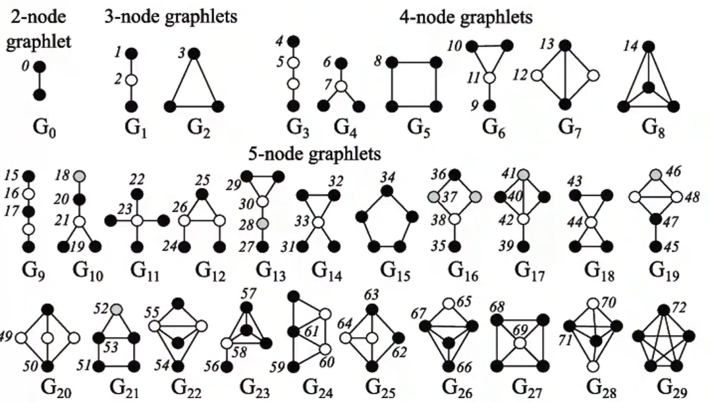

# Lecture 2: Feature Design / hand-designed features  
Traditional ML Pipeline:  
Convert Node/Edge/Graph to a vector and apply the model(Random forest/SVM/Nerual network)

We focus on undirected graph.

---
## Lecture 2.1: Node Level Tasks
* Node feature( ex). Color of node)
    * Node degree
    * Node centrality (need to consider node importance)
        * Eigenvector centrality
            * $c_v = \frac{1}{\lambda}\sum_{N(v)} c_u$, or $\lambda c=Ac$.
            * The leading eigenvector is used.
                * The largest eigenvalue is always positive.
        * Betweenness centrality
            * $c_v=\sum_{s \neq v \neq t} \frac{\#(\text { shortest paths betwen } s \text { and } t \text { that contain } v \text { ) }}{\#(\text { shortest paths between } s \text { and } t \text { ) }}$
        * Closeness centrality
            * $c_v=\frac{1}{\sum_{u \neq v} \text { shortest path length between } u \text { and } v}$
    * Clustering coefficient
        * Measures how connected $v^{\prime} s$ neighboring nodes are:
        * $e_v=\frac{\text { \#(edges among neighboring nodes) }}{\left(\begin{array}{c}k_v \\ 2\end{array}\right)} \in[0,1]$
    * Graphlets
        * generalization of the clustering coeff.(#(triangle))
        * Graphlets: Rooted connected non-isomorphic subgraphs
        * GDV(Graphlet Degree Vector) counts \#(graphlets) that a node touches
            * Degree counts \#(edges) that a node touches
            * Clustering coefficient counts \#(triangles) that a node touches.
        * After fixing a list of graphlets, get a vector.

---
- Importance-based feature:
    - Node degree
    - Different node centrality measures
- Structure-based features:
    - Node degree
    - Clustering coefficient
    - Graphlet count vector
---
## Lecture 2.2: Link-level Prediction Task
* Links missing at random
    * Remove a random set of links and then aim to predict them
* Liks over time
    * Given $G\left[t_0, t_0^{\prime}\right]$ a graph on edges up to timet $t_0^{\prime}$, output a ranked list $L$ of links (not in $\left.G\left[t_0, t_0^{\prime}\right]\right)$ that are predicted to appear in $G\left[t_1, t_1^{\prime}\right]$
        * Evaluation:
            - $n=\left|E_{\text {new }}\right|$ : \# new edges that appear during the test period $\left[t_1, t_1^{\prime}\right]$
            - Take top $n$ elements of $L$ and count correct edges
---
* Distance-based feature
    * Shortest path distance between two nodes
* Local Neighbor hood overlap
    * Common neighbors
        * $\left|N\left(v_1\right) \cap N\left(v_2\right)\right|$
    * Jaccard's coefficient
        * Normalized version
        * $\frac{\left|N\left(v_1\right) \cap N\left(v_2\right)\right|}{\left|N\left(v_1\right) \cup N\left(v_2\right)\right|}$
    * Adamic-Adar index
        * $\sum_{u \in N\left(v_1\right) \cap N\left(v_2\right)} \frac{1}{\log \left(k_u\right)}$
* Global neighborhood overlap
    * Limitation of local neighborhood features(too narrow)
    * Katz index: count the number of paths of all lengths betwwen a given pair of nodes.
        * Powers of Adj matrices
        * $S_{v_1 v_2}=\sum_{l=1}^{\infty} \beta^l \boldsymbol{A}_{v_1 v_2}^l$
            * $0<\beta < 1$ : discount factor
            * $S = \sum_{i=1}^{\infty} \beta^i \boldsymbol{A}^i=(\boldsymbol{I}-\beta \boldsymbol{A})^{-1}-\boldsymbol{I}$
---
## Lecture 2.3: Graph-level Features
### Kernel Methods
* Kernel $K\left(G, G^{\prime}\right) \in \mathbb{R}$ measures similarity b/w data
* Kernel matrix $\boldsymbol{K}=\left(K\left(G, G^{\prime}\right)\right)_{G, G^{\prime}}$ must always be positive semidefinite (i.e., has positive eigenvals)
    * There exists a feature representation $\phi(\cdot)$ such that $K\left(G, G^{\prime}\right)=\phi(G)^{\mathrm{T}} \phi\left(G^{\prime}\right)$
* Once the kernel is defined, off-the-shelf ML model, such as kernel SVM, can be used to make predictions.

Key Idea: Bag-of-Words(BoW) for a graph  
Ex: Bag of node degrees (#1, #2, #3)

* Graphlet Features
    * Count the number of different graphlets in a graph.
        * Definition is slightly different from node-level features.
            * not rooted / disconnected
    * Given a graphlet list, define the graphlet count vector.
    * $K(G, G')$: inner product of the vectors.
    * Problems
        * if $G$ and $G^{\prime}$ have different sizes, that will greatly skew the value.
            * Solution: normalize each feature vector
            $
            \boldsymbol{h}_G=\frac{\boldsymbol{f}_G}{\operatorname{Sum}\left(\boldsymbol{f}_G\right)} \quad K\left(G, G^{\prime}\right)=\boldsymbol{h}_G{ }^{\mathrm{T}} \boldsymbol{h}_{G^{\prime}}
            $
        * Counteing graphlets is very expensive.(NP-hard)
* Weisfeiler-Lehman Kernel
    * Also known as color refinement
    * Goal: design an efficient graph feature descriptor
    * Use neighborhood structure to iteratively enrich node vocab.
        * Assign an initial color $c^{(0)}(v)$ to each node $v$.
        * $c^{(k+1)}(v)=\operatorname{HASH}\left(\left\{c^{(k)}(v),\left\{c^{(k)}(u)\right\}_{u \in N(v)}\right\}\right)$
    * After (several) color refinement, WL kernel counts number of nodes with a given color, and get a vector.
    * Use the dot product btw them.
    * O(#(edges)) for each step