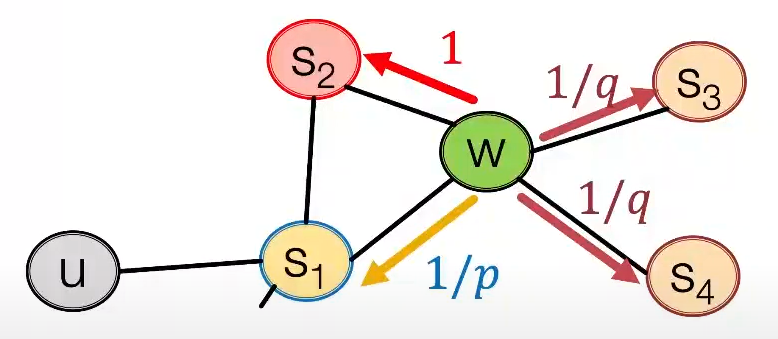

# Lecture 3: Graph Representation Learning
We wanna kind of automatically learn the features, not using hand-crafted features.  
Goal: task-independent feature learning for machine learning with graphs.

---
## Lecture 3.1: Node Embeddings: Encoder and Decoder
* Encode nodes so that similarity in the embedding space(dot product / angle) approximates similarity in the original graph.  
* Decoder maps from embeddings to the simliarity score.
* Shallow encoding : Embedding matrix (#(nodes) x embedding dim)
    * embedding-lookup

How to define node similarity: Random walk based method in this course.

---
## Lecture 3.2: Random Walk Approaches for Node Embeddings
Notation:
* $z_u$: embedding of node $u$
* $P(v|z_u)$: The (predicted) probability of visiting node $v$ on random walks starting from node $u$.
* $N_R(u)$: multiset of neighborhood of $u$ obtained by some random walk strategy $R$.
* $\sigma$: sigmoid function

Goal: $z_u^T z_v\sim$ probability that $u$ and $v$ co-occur on a random walk over the graph.  
Idea: Learn node embedding such that `nearby` nodes are close together.

* Learn $f:V\rightarrow \mathbb{R}^d$  
* Objective: $\max _f \sum_{u \in V} \log \mathrm{P}(N_{\mathrm{R}}(u) | \mathbf{z}_u)$ 
* Equivalently, minimze $\mathcal{L}=-\sum_{u \in V} \sum_{v \in N_R(u)}\log \left(P\left(v \mid \mathbf{z}_u\right)\right)$
* Parameterize the probability using softmax $P\left(v \mid \mathbf{z}_u\right)=\frac{\exp \left(\mathbf{z}_u^{\mathrm{T}} \mathbf{z}_v\right)}{\sum_{n \in V} \exp \left(\mathbf{z}_u^{\mathrm{T}} \mathbf{z}_n\right)}$

## Negative sampling
$\log \left(\frac{\exp \left(\mathbf{z}_u^{\mathrm{T}} \mathbf{z}_v\right)}{\sum_{n \in V} \exp \left(\mathbf{z}_u^{\mathrm{T}} \mathbf{z}_n\right)}\right) \approx \log \left(\sigma\left(\mathbf{z}_u^{\mathrm{T}} \mathbf{z}_v\right)\right)-\sum_{i=1}^k \log \left(\sigma\left(\mathbf{z}_u^{\mathrm{T}} \mathbf{z}_{n_i}\right)\right), n_i \sim P_V$

Sample $k$ negative nodes each with prob. proportional to its degree
Two considerations for $k$ (\# negative samples):
1. Higher $k$ gives more robust estimates
2. Higher $k$ corresponds to higher bias on negative events
In practive, $k=5\sim 20$.

## How should we randomly walk? (strategy R)
* Node2vec: Biased random walks that can trade off between the local and global views(BFS vs DFS).
    * BFS: Micro-vew of neighbourhood
    * DFS: Macro-vew of neighbourhood
    * Two parameters:
        * return parameter $p$
        * in-out parameter $q$
            * Moving outwards (DFS) vs. inwards (BFS)
            * Intuitively, $q$ is the "ratio" of BFS vs. DFS

---
## Lecture 3.3: Embedding Entire Graphs
* Approach 1
    * Run a standard graph embedding and sum or average the node embedding
* Approach 2
    * Introduce a "virtual node" to represent the (sub)graph and run a standard graph embedding technique
* Approach 3: Anonymous Walk Embedding
    * States in `anonymous` walks correspond to the index of the first time we visited the node in a random walk
    * For each random walk, we get a sequence of numbers: 1/2/1/2/3/..
    * Represent the graph as a prob. distrib. over these walks.
    * For example:
        * Set $l=3$
        * Then we can represent the graph as a 5-dim vector - Since there are 5 anonymous walks $w_i$ of length 3: 111,112, 121, 122, 123
        * $Z_G[i]=$ probability of anonymous walk $w_i$ in $G$
    * How many random walks $m$ do we need?
        * We want the distribution to have error of no more than $\varepsilon$ with prob. less than $\delta$ :
        * $m=\left[\frac{2}{\varepsilon^2}\left(\log \left(2^\eta-2\right)-\log (\delta)\right)\right]$

* Approach 4: Learn Walk Embedding
    * Learn a graph embedding together with all the anonymous walk embedding $z_i$.
        * Sample anonymous random walk from a node $\{w_1, w_2, \dots, w_i\}$.
        * Learn to predict walks that co-occur in $\Delta$-size window (e.g. predict $w_2$ given $w_1, w_3$ if $\Delta=1$ ) 
        * Objective:
            $$
            \max \sum_{t=\Delta}^{T-\Delta} \log P\left(w_t \mid w_t-\Delta, \ldots, w_{t+\Delta}, \mathbf{z}_G\right)
            $$
            * $P\left(w_t \mid\left\{w_{t-\Delta}, \ldots, w_{t+\Delta}, z_G\right\}\right)=\frac{\exp \left(y\left(w_t\right)\right)}{\sum_{i=1}^\eta \exp \left(y\left(w_i\right)\right)}$
            * $y\left(w_t\right)=b+U \cdot\left(\operatorname{cat}\left(\frac{1}{2 \Delta} \sum_{i=-\Delta}^{\Delta} z_i, z_G\right)\right)$
        * Sum the objective over all nodes in the graph
        * After training, we can use the inner product btw graphs or use this vector as input to classify.

---
Preview: Hierachical Embeddings  

We will discuss more advanced ways to obtain graph embeddings in Lecture 8.
We can hierarchically cluster nodes in graphs, and sum/avg the node embeddings according to these clusters.
* graph pooling
---
* How to use node embeddings?
    * clustering / community detection
    * node classification
    * link prediction
        * Concatenate
        * Hadamard
        * Sum/Avg
        * Distance
    * graph embedding
        * via aggregating node embeddings or anonymous random walk