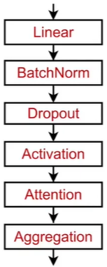
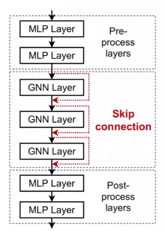

# Lecture 7
## Lecture 7.1: A general Perspective on GNNs
* There are two aspects: Message / Aggregation  
  * Different architectures like GCN, GraphSAGE, graph attention networks and so on and so forth, what they differ is how they define this notion of aggregation.
* Layer connectivity(ex. sequentially / skip connections)
* Augmentation: Graph feature augmentation / Graph structure manipulation
* Learning objective(supervised / unsupervised , node/edge/graph level objectives)

## Lecture 7.2: A Single Layer of a GNN

* Message Computation
  * $\mathbf{m}_u^{(l)}=\operatorname{MSG}^{(l)}\left(\mathbf{h}_u^{(l-1)}\right)$
    * Example: A Linear layer $\mathbf{m}_u^{(l)}=\mathbf{W}^{(l)} \mathbf{h}_u^{(l-1)}$
* Message Aggregation
  * Order invariant
  * $\mathbf{h}_v^{(l)}=\mathrm{AGG}^{(l)}\left(\left\{\mathbf{m}_u^{(l)}, u \in N(v)\right\}\right)$
    * Example: $\operatorname{Sum}(\cdot), \operatorname{Mean}(\cdot)$ or $\operatorname{Max}(\cdot)$ aggregator
    * $$\mathbf{h}_v^{(l)}=\operatorname{Sum}\left(\left\{\mathbf{m}_u^{(l)}, u \in N(v)\right\}\right)$$
  * Issue: Information from node $v$ itself could get lost
    * Solution: Include $\mathbf{h}_v^{(l-1)}$ when computing $\mathbf{h}_v^{(l)}$
      * Example: $\mathbf{h}_v^{(l)}=\operatorname{CONCAT}\left(\operatorname{AGG}\left(\left\{\mathbf{m}_u^{(l)}, u \in N(v)\right\}\right), \mathbf{m}_v^{(l)}\right)$
      
---
* GraphSAGE
  * $\mathbf{h}_v^{(l)}=\sigma\left(\mathbf{W}^{(l)} \cdot \operatorname{CONCAT}\left(\mathbf{h}_v^{(l-1)}, \operatorname{AGG}\left(\left\{\mathbf{h}_u^{(l-1)}, \forall u \in N(v)\right\}\right)\right)\right)$
    * Aggregation - example: Mean, Pool(ex. Mean, Max), LSTM(to ignore the order)
  * $\ell_2$ normalization(optional)
    * $\mathbf{h}_v^{(l)} \leftarrow \frac{\mathbf{h}_v^{(l)}}{\left\|\mathbf{h}_v^{(l)}\right\|_2} \forall v \in V$
    * Without $\ell_2$ normalization, the embedding vectors have different scales ( $\ell_2$-norm) for vectors.
* GAT (Graph Attention Networks)
  * $\mathbf{h}_v^{(l)}=\sigma\left(\sum_{u \in N(v)} \alpha_{v u} \mathbf{W}^{(l)} \mathbf{h}_u^{(l-1)}\right)$ where the $\alpha$ is the Attention weights
  * How much attention to pay to a given, to a message from a given node u?
  * In GCN / GraphSAGE, all neighbors $u \in N(v)$ are equally important to node $v$.
  * Mechanism
    * $\alpha$ given mechanism (ex. $\operatorname{Linear}(\operatorname{Concat}(\mathbf{W}^{(l)} \mathbf{h}_A^{(l-1)}, \mathbf{W}^{(l)} \mathbf{h}_B^{(l-1)}))$)
    * Compute $e_{v u}=a(\mathbf{W}^{(l)} \mathbf{h}_u^{(l-1)}, \mathbf{W}^{(l)} \boldsymbol{h}_v^{(l-1)})$
    * Normalize: $\alpha_{v u}=\frac{\exp(e_{v u})}{\sum_{k \in N(v)} \exp (e_{v k})}$
  * This can be quite finicky: Convergence
    * Solution: Multi-head attention
    * Each one of them is kind of going to converge to some local minima. But because we are using multiple of them, and we are averaging their transformations together, this will basically allow our model to be more robust, it will allow our learning process not to get stuck in some weird part of the optimization space, and it will work better on the average.
  * Benefits
    * Computatinoally efficient: parallelized
    * Storage efficient: $O(V+E)$
    * Localized / Inductive capability : Only attends over local network neighborhoods / It doesn't depend on the global grph structure
---
### GNN Layer in Practive
* Many modern deep learning modules can be incorporated
  * Batch Norm: Compute the mean and variance over $N$ embeddings (ex: $\boldsymbol{\mu}_j=\frac{1}{N} \sum_{i=1}^N \mathbf{X}_{i, j}$)
  * Dropout: in message function
  * Attention/Gating

---
## Lecture 7.3: Stacking layers of a GNN
* The Over-smoothing Problem: all the node embeddings converge to the same value.
  * The issue of stacking many GNN layers.
  * If the receptive fields are too big, then basically all the neural networks collect the same information.
  * Lessons:
    * Be cautious when adding GNN layers.
      * Analyze the necessary receptive field.
      * Set number of GNN layers $L$ to be a bit more than the receptive field.
      * How to make a shallow GNN more expressive?
        * Increase the expressive power within each GNN layer.
        * We can add MLP layers before/after GNN layers.
    * We can add skip connections
      * a mixture of models / We automatically get a mixture of shallow GNNs and deep GNNs.
      * Ex. $\mathbf{h}_v^{(l)}=\sigma(\sum_{u \in N(v)} \mathbf{W}^{(l)} \frac{\mathbf{h}_u^{(l-1)}}{|N(v)|}+\mathbf{h}_v^{(l-1)})$

