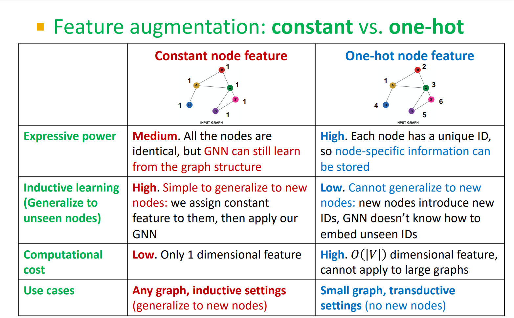
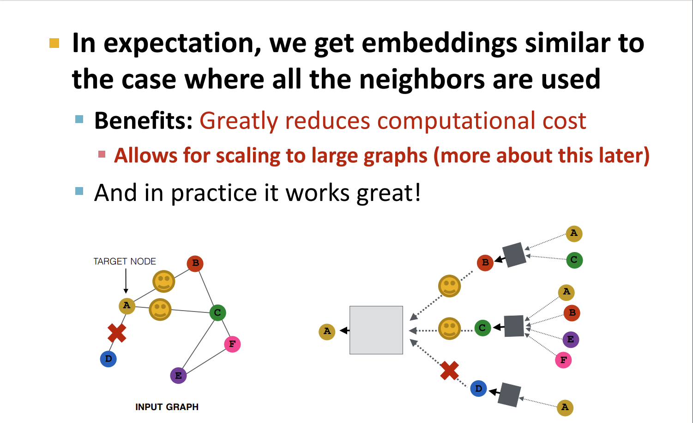
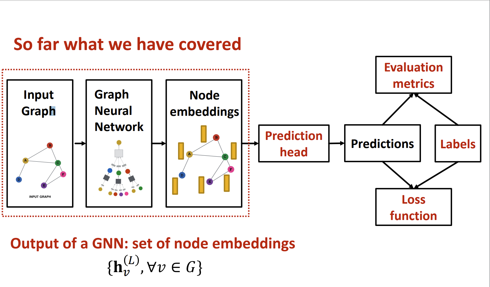
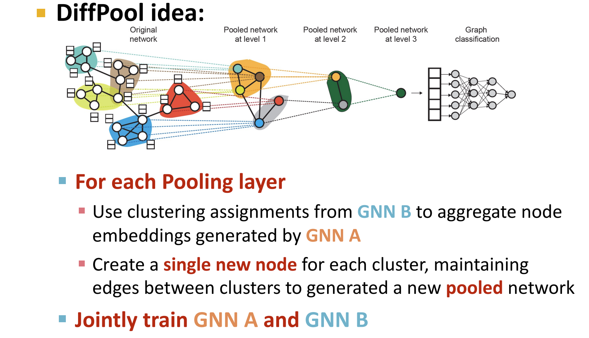
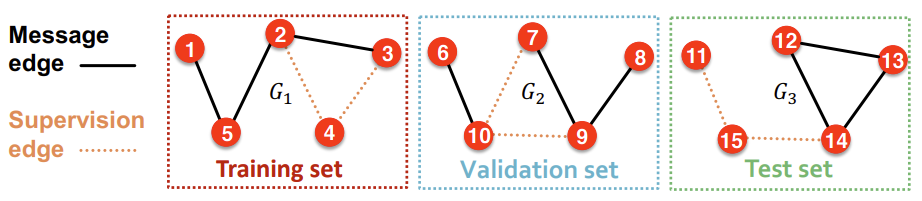
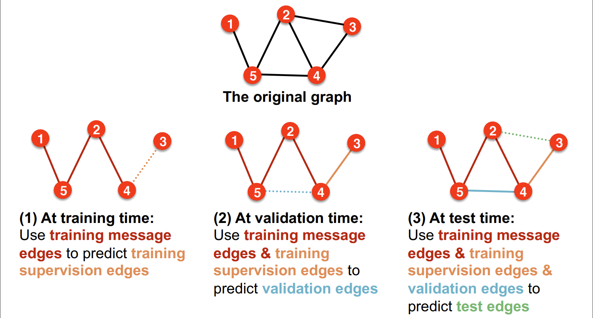

# Lecture 8
## Lecture 8.1: Graph Augmentation for GNNs
* GNN structure is determined by the shape of the graph.
* Usually, augmentation of a graph is needed when
  * input graph lacks features ---> feature augmentation
  * graph is too sparse ---> adding virtual nodes/edges
  * graph is too dense --->  choosing only a subset of neighbors when doing message passing
  * graph is too large ---> subsampling the entire graph
---
* Feature augmentation
  * constant values to nodes
  * (0,0,...,1,...,0) to each node (assigning a unique one-hot vector)
    * invariant under the ordering of nodes...?
  * cycle count
  * node degree
  * etc.

<!--  -->
---
* Adding virtual edges 
  * Connect two nodes if their graph distance is 2
  * $A \leftarrow A + A^2$
* Adding virtual nodes
  * Cone construction
  * All nodes will have a distance 2
  * Greatly improves message passing in sparse graph
---
* Node neighborhood sampling
 
<!--  -->
---
## Lecture 8.2 Training Graph Neural Networks
* GNN training pipeline
<!--  -->
---
* Prediction head (output of final model)
  * Node/edge/graph level predictions are possible
* Node-level prediction
  * Each node has a d-vector after GNN computation
  * Apply usual classification/regression technique on each node
* Edge-level prediction
  * Prediction between $u, v$ will be $\hat{y}_{uv} = f(h_{u}^{(L)},h_{v}^{(L)})$  
  * Options for $f$
    * $f(h_{u}^{L},h_{v}^{L})$ = $Linear(Concat(h_{u}^{(L)},h_{v}^{(L)}))$ 
    * Dot-product for 1-dim output
    * $k$-different inner-products for k-dim output
      * $\hat{y}_{uv}^{(1)} = (h_{u}^{(L)})^{T}W^{(1)}h_{v}^{(L)}$
      * ...
      * $\hat{y}_{uv}^{(k)} = (h_{u}^{(L)})^{T}W^{(k)}h_{v}^{(L)}$ 
* Graph-level prediction
  * Aggregate all heads $\{h_{u}^{(L)}, u\in G\}$
  * $f(\{h_{u}^{(L)}, u\in G\})$
  * Options for $f$
    * Mean/max/sum pooling (for small graphs)
    * Hierarchical global pooling (for large graphs)
    <!--  -->
---
* Predictions/labels
  * Supervised setting
    * Node/edge/graph labels
  * Unsupervised setting
    * Node-level; Learn node statistics. Clustering coeff, pagerank, etc.
    * Edge-level; Link prediction. Hide the edge and predict if there should be a link
    * Graph-lebel; Graph statistics. ex)predict if two graphs are isomorphic.     
---
* Loss function
  * N training examples(nodes, edges, or graphs)
  * Cross entropy between two probability distributions is 
   $$ CE(p,q)=-E_{p}[log(q)]=-\int log(q(x)) p(x)dx$$
  * In ML context, $p$ is usually the empirical distribution, and q is the model distribution. 
  
    ex) 3-class classification\
    events = {red, green, blue}\
        p = {0.0,0.0,1.0}\
        q = {0.1,0.2,0.7}\
        $CE=-\sum_{i=1}^{3}log(q_i)p_i=-log(0.7) = 0.1549...$

    ex) regression\
    $q(y|x)=Normal(y;f(x;\theta),I)$\
    $CE\propto ||y_{true}-f(x;\theta)||^2$
  * $Loss=\sum_{i=1}^{N}CE(x_i)$   
---
## Lecture 8.3: Setting up GNN Prediction Tasks
* Data split
  * Fixed split; split dataset only once
  * Random split; split randomly manytimes, and report averageperformance 
  * There are some difficulties.\
    ex) In node classification, data points are not independent.
* Transductive learning
  * The input graph can be observed in all the dataset splits(train/validation/test)
  * Split only the node labels
* Inductive setting
  * Break edges to get disconnected graphs. 
  * Each components becomes either of training/validation/test sets.
  * Not prefered when graph is small.
* Link prediction
  * Goal : Predict missing edges
  * Hide some edges from GNN and let the GNN predict if the edges exist.
  * Step1. Split edges into 2 types;
    * Message edges : Used for GNN training
    * Supervision edges : Used for computing objectives(loss)
  * Step2. Split edges into train/valid/test sets;
    * There are two ways to doing this.
    * Inductive split
    
    * Transductive split (default)
    
