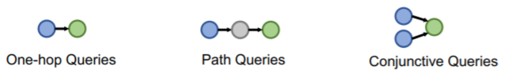
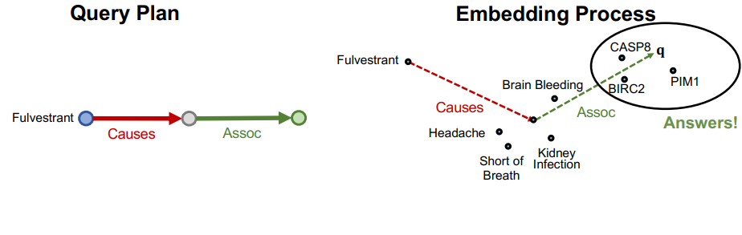
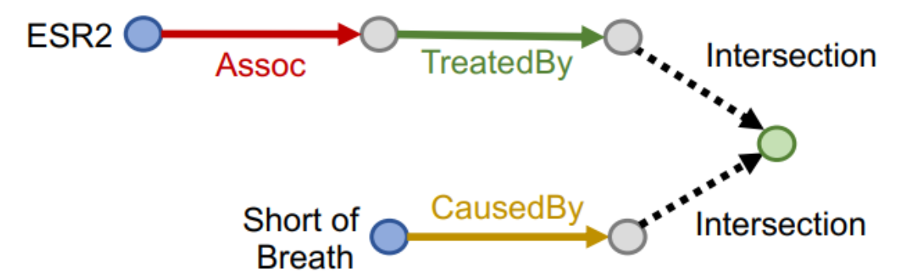
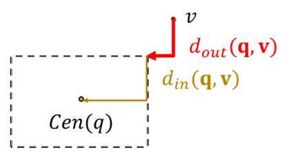

# Lecture 11
- Goal:
    - How to perform multi-hop reasoning over KGs?
- Reasoning over Knowledge Graphs
  - Answering multi-hop queries
    - Path Queries
    - Conjunctive Queries
  - Query2box

# One-hop Query
- KG completion
- One-hop query: Is $t$ an answer to query $(h,(r))$?
# Path Queries
- An $n$-hop path query $q$ can be represented by $q=\left(v_a,\left(r_1, \ldots, r_n\right)\right)$ where $v_a$ is an `anchor` entity, answers are denoted by $\llbracket q \rrbracket_G$.
- seems easy
  - traverse
    - KGs are incomplete
    - non-trivial time and cost
  - traverse with completed probabilistic KG
    - too dense graph
    - time complexity is exponential
- Answering Predictive Queries
  - Key idea: Embed queries !
    - Generalize TransE to multi-hop reasoning.
    - Given a path query $q=\left(v_{a},\left(r_1, \ldots, r_{n}\right)\right)$, 
    $$q=v_a+r_1+\cdots+r_n$$ 
    - whatever is close to the point q, that's the answer.
    - For TransR / DistMult / ComplEx, they cannot handle composition relations.

# Conjunctive Queries

## Box embeddings
- Embed queries with hyper-rectangles (boxes)
    $$
    q=(\text{Center}(q), \text{offset}(q))
    $$
  - For example, we can embed the adverse events of Fulvestrant with a box that enclose all the answer entities.
- Intersection of boxes is well-defined!
## Things to figure out:
- Entity embeddings (# params: $d|V|$ ):
  - Entities are seen as zero-volume boxes
- Relation embeddings (# params $2 d|R|$ )
  - Each relation takes a box and produces a new box
- Intersection operator $f$ :
  - New operator, inputs are boxes and output is a box
  - Intuitively models intersection of boxes
    - Projection operator
        $$
        \text{Cen}\left(q^{\prime}\right)=\text{Cen}(q)+\text{Cen}(r)
        $$
        $$
        \text{off}\left(q^{\prime}\right)=\text{off}(q)+\text{off}(r)
        $$
    - Geometric Intersection Operator
        $\mathcal{J}: Box \times \cdots \times Box \rightarrow Box$
        $$
        \text{Cen}\left(q_{\text {inter }}\right)=\sum_i w_i \odot \text{Cen}\left(q_i\right)
        $$
        where
        $$
        w_i=\frac{\exp \left(f_{\text {cen }}\left(\text{Cen}\left(q_i\right)\right)\right)}{\sum_j \exp \left(f_{\text {cen }}\left(\text{Cen}\left(q_j\right)\right)\right)} \quad \begin{gathered}
        \text{Cen}\left(q_i\right) \in \mathbb{R}^d \\
        w_i \in \mathbb{R}^d,
        \end{gathered}
        $$
        and 
        $$\text{off} \left(q_{\text {inter }}\right)=\min \left(\text{off}\left(q_1\right), \ldots\text{off}\left(q_n\right)\right) \odot \sigma\left(f_{\text {off }}\left(\text{off}\left(q_1\right), \ldots\text{off}\left(q_n\right)\right)\right)$$
        where $f_{cen}$ and $f_{off}$ are trainable and $\sigma$ is the sigmoid function.

---
## Entity-to-Box Distance
- How do we define the score function $f_q(v)$ (negative distance)? 
- Given a query box $q$ and entity embedding (box) $v$,
$$
d_{box}(q, v)=d_{out}(q, v)+\alpha \cdot d_{in}(q, v)
$$
where $0<\alpha<1$.
- Intuition: if the point is enclosed in the box, the distance should be downweighted.
$$ f_q(v)=-d_{box}(q, v)$$

# Embedding AND-OR Queries
- Can we embed AND-OR queries in a lowdimensional vector space?
  - No! Intuition: Allowing union over arbitrary queries requires high-dimensional embeddings!
- Key idea: take all unions out and only do union at the last step!
## Disjunctive Normal Form(DNF)
Given any AND-OR query $q$,
$$
q=q_1 \vee q_2 \vee \cdots \vee q_m
$$
where $q_i$ is a conjunctive query.

Distance between entity embedding and a DNF:  
$$
d_{box}(q, v)=\min \left(d_{\text {box}}\left(q_1, v\right), \ldots, d_{\text{box}}\left(q_m, v\right)\right)
$$

# Training procedure
1. Randomly sample a query $q$ from the training graph $G_{\text {train }}$, answer $v \in \llbracket q \rrbracket_{G_{\text {train }}}$, and a negative sample $v^{\prime} \notin \llbracket q \rrbracket_{G_{\text {train }}}$.
   - Negative sample: Entity of same type as $v$ but not answer.
2. Embed the query q.
3. Calculate the score $f_q(v)$ and $f_q\left(v^{\prime}\right)$.
4. Optimize the loss $\ell$ to maximize $f_q(v)$ while minimize $f_q\left(v^{\prime}\right)$ :
$$
\ell=-\log \sigma\left(f_q(v)\right)-\log \left(1-\sigma\left(f_q\left(v^{\prime}\right)\right)\right)
$$

* Generate queries from multiple query templates.
* Backward method: 
    * Start from instantiating the answer node of the query template and then iteratively instantiate the other edges and nodes until we ground all the anchor nodes
