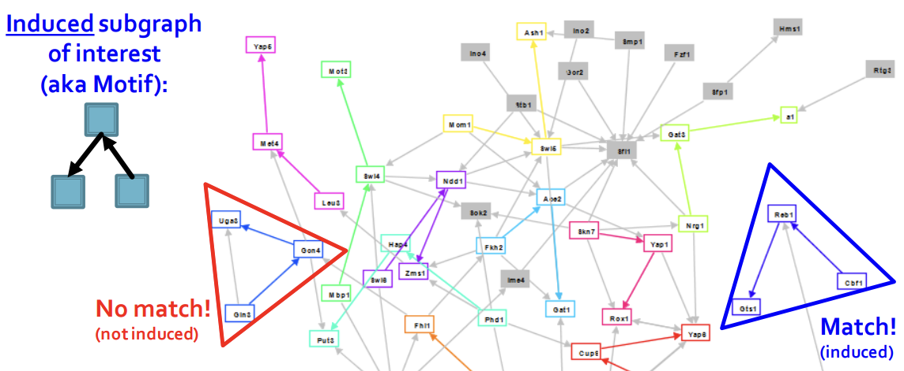
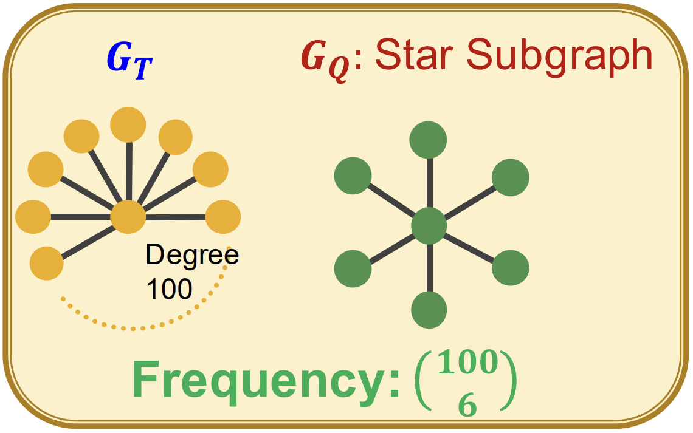
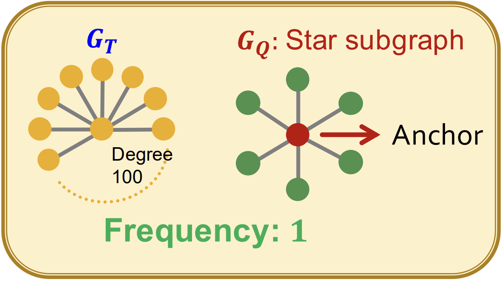
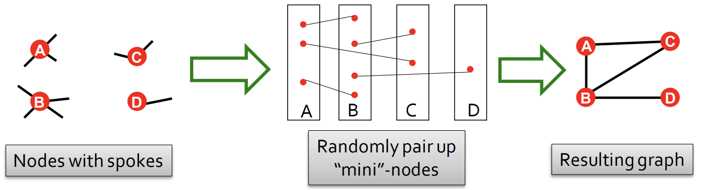
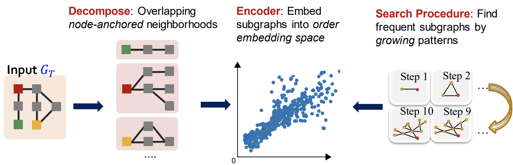
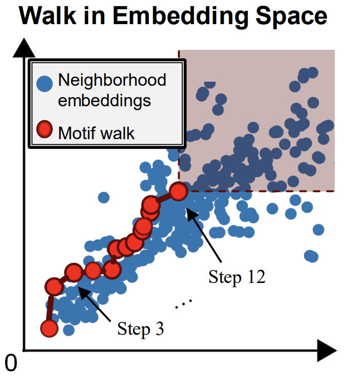

# Lecture 12: Fast Neural Subgraph Matching and Counting

## Lecture 12.1: Subgraphs and Motifs
* Two ways to formalize "network building blocks"
    * Def 1. Node-induced subgraph ("induced subgraph")
    * Def 2. Edge-induced subgraph ("non-induced subgraph" or "subgraph")
* The best definition depends on the domain.
    * Chemistry: Node induced / Knowledge graphs: Often edge-induced.

---

* Graph isomorphism problem: 
  * Check whether two graphs are identical
  * The problem is not known to be solvable in polynomial time nor to be NP-complete

* Subgraph Isomorphism Problem: For undirected graphs, the problem is to check whether $G_1$ is isomorphic to a subgraph of $G_2$.
    * NP hard.
    * We can also think of the directed case.

---

(Network) Motifs: "recurring, significant patterns of interconnections"
* Help us make predictions based on presence or lack of presence in a graph dataset

* Subgraph Frequency
  * Graph-level Subgraph Frequency Definition
    * The number of unique subsets of nodes $V_T$ of $G_T$ for which the subgraph of $G_T$ induced by the nodes $V_T$ is isomorphic to $G_Q$.
    * 
    <!--  -->
  * Node-level Subgraph Frequency Definition
    * The number of nodes $u$ in $G_T$ for which some subgraph of $G_T$ is isomorphic to $G_Q$ and the isomorphism maps node $u$ to $v$.
    <!-- *  -->
    * 
    <!--  -->
    * Let $(G_Q, v)$ be called a node-anchored subgraph

---

### Motif Significance

* To define significance, we need to have a null-model (i.e., point of comparison).
* Key idea: Subgraphs that occur in a real network much more often than in a random graph have functional significance.
* Random graph
  * Erdős-Rényi (ER) random graphs: $G_{n, p}$
  * Configuration Model
    * Generate a random graph with a given degree sequence.
    * We can compare the real network $G^{\text {real }}$ and a "random" $G^{\text {rand }}$ which has the same degree sequence as $G^{\text {real }}$
    * 

Intuition: Motifs are overrepresented in a network when compared to random graphs:

* Step 1: Count motifs in the given graph $\left(G^{\text {real }}\right)$
* Step 2: Generate random graphs with similar statistics (e.g. number of nodes, edges, degree sequence), and count motifs in the random graphs
* Step 3: Use statistical measures to evaluate how significant is each motif
  * $Z$-score: $ Z_i=\left(N_i^{\text {real }}-\bar{N}_i^{\text {rand }}\right) / \operatorname{std}\left(N_i^{\text {rand }}\right) $
    * $N_i^{\text {real }}$ is \#(motif $i$ ) in graph $G^{\text {real }}$
    * $\bar{N}_i^{\text {rand }}$ is average \#(motifs $i$ ) in random graph instances

Network significance profile (SP):
$$
S P_i=Z_i / \sqrt{\sum_j Z_j^2}
$$
* $S P$ is a vector of normalized Z-scores
* Important for comparison of networks of different sizes

### Variations on the Motif Concept

* Extensions:
    * Directed and undirected
    * Colored and uncolored
    * Temporal and static motifs
- Variations on the concept:
     - Different frequency concepts
    - Different significance metrics
    - Under-Representation (anti-motifs)
    - Different null models

## Lecture 12.2: Neural Subgraph Matching

* Given: 
    * Large target graph (can be disconnected)
    * Query graph (connected)
* Decide:
    * Is a query graph a subgraph in the target graph? (yes or no)
        * NP-hard

We are going to use a graph neural network to predict, and (therefore) work with node-anchored neighborhoods.

### Order Embedding Space
Consider $\mathbb{R}^n$ as a partially ordered space, and embed neighborhoods of nodes so that the embedding preserves the ordering.
* Properties: Transivity, Anti-symmetry, Closure under intersection

Training:
* Max-margin loss: $E\left(G_q, G_t\right)=\sum_{i=1}^D\left(\max \left(0, z_q[i]-z_t[i]\right)\right)^2$
    * $E\left(G_q, G_t\right)=0$ when $G_q$ is a subgraph of $G_t$
    * $E\left(G_q, G_t\right)>0$ when $G_q$ is not a subgraph of $G_t$
    * For positive examples: Minimize $E\left(G_q, G_t\right)$ when $G_q$ is a subgraph of $G_t$
    * For negative examples: Minimize $\max \left(0, \alpha-E\left(G_q, G_t\right)\right)$
        * Max-margin loss prevents the model from learning the degenerate strategy of moving embeddings further and further apart forever  

Training Example Construction: 
* Positive examples: Use BFS sampling
* Negative examples: "corrupt" $G_Q$ by adding/removing nodes/edges so it's no longer a subgraph.

How deep is the BFS sampling?
* A hyper-parameter that trades off runtime and performance
* Usually use 3-5, depending on size of the dataset

## Lecture 12.3: Finding Frequent Subgraphs

### Finding Frequent Subgraphs

* Task:
    * Enuerating: all size-$k$ connected subgraphs
    * counting: #(occurrences of each subgraph type)
* Problems:
    * Combinatorial explosion of number of possible patterns
    * Counting subgraph frequency is NP-hard

- Caution: We use the node-level definition !

### SPMiner

* How to add a node?
    * Def - Total violation of a subgraph $G$: the number of neighborhoods that do not contain $G$.
    * The number of neighborhoods $G_{N_i}$ that do not satisfy $z_Q \preccurlyeq z_{N_i}$
    * Minimizing total violation $=$ maximizing frequency
    * Greedy strategy (heuristic): At every step, add the node that results in the smallest total violation

<!-- 가장 frequent하지 않은 2~7위의 정보는 어떻게 얻었지? 논문에 greedy방법 말고 다른 방법도 있는듯. -->