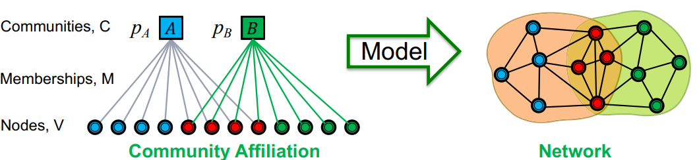

# Lecture 13: Community Detection in Networks
## Lecture 13.1
* Granovertter makes a connection between the social and structural role of an edge
    * Structure
        * Structurally embedded edges are also socially strong
        * Long-range edges spanning different parts of the network are socially weak
    * Information
        * Long-range edges allow you to gather information from different parts of the network and get a job
        * Structurally embedded edges are heavily redundant in terms of information access

- How community forms?
    - Triadic closure is the property among three nodes A, B, and C (representing people, for instance), that if the connections A-B and A-C exist, there is a tendency for the new connection B-C to be formed

## Lecture 13.2: Network Communities
Terms: Communities, clusters, groups, modules

### Define: Modularity $\boldsymbol{Q}$
- A measure of how well a network is partitioned into communities
- Given a partitioning of the network into groups disjoint: 
    - $\boldsymbol{s} \in \boldsymbol{S}$ : $Q \propto \sum_{s \in S}$ [ (\# edges within group $s$ ) $(\operatorname{expected} \#$ edges within group $s)]$
    - need a null model: Configuration Model
        - Cosider multigraph
        - The expected number of edges between nodes $\boldsymbol{i}$ and $\boldsymbol{j}$ of degrees $\boldsymbol{k}_{\boldsymbol{i}}$ and $\boldsymbol{k}_{\boldsymbol{j}}$ equals: $\boldsymbol{k}_{\boldsymbol{i}} \cdot \frac{\boldsymbol{k}_j}{2 m}=\frac{\boldsymbol{k}_{\boldsymbol{i}} \boldsymbol{k}_j}{2 m}$
            - There are $2 m$ directed edges (counting $i\rightarrow j$ and $j\rightarrow i$ ) in total.
            - For each of $k_i$ out-going edges from node $i$, the chance of it landing to node $j$ is $k_j / 2 m$, hence $k_i k_j / 2 m$.
    - $Q(G, S)=\frac{1}{2 m} \sum_{s \in S} \sum_{i \in S} \sum_{j \in S}\left(A_{i j}-\frac{k_i \boldsymbol{k}_j}{2 m}\right)$
        - $A_{i j}=1$ iff $i \rightarrow j$
        - $-1 \leq Q \leq 1$
        - It is positive if the number of edges within groups exceeds the expected number 
        - $\mathbf{Q}$ greater than $\mathbf{0 . 3 - 0 . 7}$ means significant community structure

## Lecture 13.3: Louvain Algorithm
* greedily maximizes modularity
* Supports weighted graphs
* Provides hierarchical communities
* $O(n\log n)$ where $n$ is the number of nodes
---
* Put each node in a graph into a distinct community
* Phase 1: Modularity is optimized by allowing only local changes to node-communities memberships
    * Compute the modularity delta $(\Delta Q)$ when putting node $i$ into the community of some neighbor $j$
    * Move $i$ to a community of node $j$ that yields the largest gain in $\Delta Q$
$$
\begin{aligned}
\Delta Q(i \rightarrow C)= & Q_{\text {after }}-Q_{\text {before }} \\
= & {\left[\frac{\Sigma_{i n}+k_{i, i n}}{2 m}-\left(\frac{\Sigma_{t o t}+k_i}{2 m}\right)^2\right] } \\
& -\left[\frac{\Sigma_{i n}}{2 m}-\left(\frac{\Sigma_{t o t}}{2 m}\right)^2-\left(\frac{k_i}{2 m}\right)^2\right]
\end{aligned}
$$
$\Delta Q(D \rightarrow i)$ can be derived similarly, and $\Delta Q(D \rightarrow i \rightarrow C)=\Delta Q(D \rightarrow i)+\Delta Q(i \rightarrow C)$.
* Phase 2: The identified communities are aggregated into super-nodes to build a new network

Note that the output of the algorithm depends on the order in which the nodes are considered.

## Lecture13.4: Detecting Overlapping Communities: BigCLAM

We want to detect overlapping communities.

- Step 1)
    - Define a generative model for graphs that is based on node community affiliations 
        - Community Affiliation Graph Model (AGM)
- Step 2)
    - Given graph $G$, make the assumption that $G$ was generated by AGM
    - Find the best AGM that could have generated $G$
    - And this way we discover communities

### Community-Affiliation Graph Model (AGM)

Given parameters $\left(V, C, M,\left\{p_c\right\}\right)$
- Nodes in community $c$ connect to each other by flipping a coin with probability $\boldsymbol{p}_{\boldsymbol{c}}$
- $p(u, v)=1-\prod_{c \in M_u \cap M_v}\left(1-p_c\right)$

---

How to estimate model parameters $F$ given a $G$?
- Maximum likelihood estimation
- To solve this we need to:
    - Efficiently calculate $\boldsymbol{P}(\boldsymbol{G} \mid \boldsymbol{F})$
    - Then maximize over $\boldsymbol{F}$ (e.g., using gradient descent)
    
but How?

---
### "Relaxing" AGM: Towards $P(u,v)$
Memberships have strengths:
* $F_{u A}:$ The membership strength of node $u$ in $A$
* Then, we set $P_C(u, v)=1-\exp \left(-F_{u C} \cdot F_{v C}\right)$
    * $P_C(u, v)=0$ iff $F_{u C} \cdot F_{v C}=0$ (i.e., $F_{u C}=0$ or $F_{v C}=0$ )
    * $P_C(u, v) \approx 1$ iff $F_{u C} \cdot F_{v C}$ is large.
* Expanding $P(\boldsymbol{u}, \boldsymbol{v})$ :
    * $P(u, v)=1-\prod_{C \in \Gamma}\left(1-P_C(u, v)\right) = 1-\exp \left(-\boldsymbol{F}_{\boldsymbol{u}}^T \boldsymbol{F}_{\boldsymbol{v}}\right)$
    * where $\boldsymbol{F}_{\boldsymbol{u} \boldsymbol{C}}:$ A vector of $\left\{F_{u c}\right\}_{C \in \Gamma}$

Therefore, we have our objective:

$\begin{aligned} P(G \mid \boldsymbol{F}) & =\prod_{(u, v) \in E} P(u, v) \prod_{(u, v) \notin E}(1-P(u, v)) \\ & =\prod_{(u, v) \in E}\left(\mathbf{1}-\exp \left(-\boldsymbol{F}_{\boldsymbol{u}}^{\boldsymbol{T}} \boldsymbol{F}_{\boldsymbol{v}}\right)\right) \prod_{(u, v) \notin E} \exp \left(-\boldsymbol{F}_{\boldsymbol{u}}^{\boldsymbol{T}} \boldsymbol{F}_{\boldsymbol{v}}\right)\end{aligned}$

* Use log-likelihood, and gradient ascent
* Naïve gradient ascent is slow! but we can improve - refer to the pdf.
