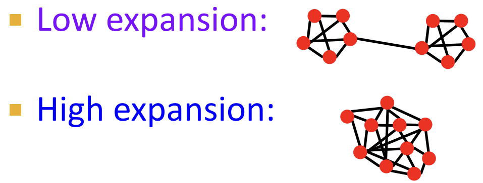
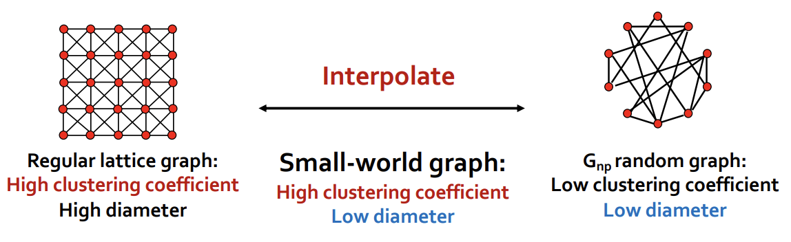
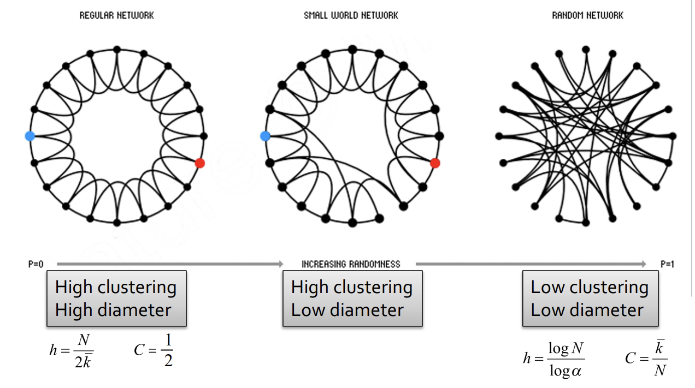
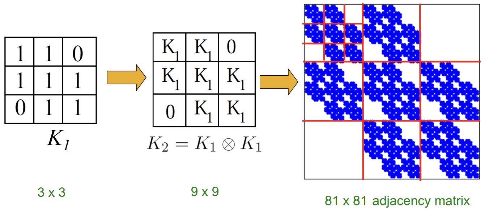

# Lecture 14: Generative Models for Graphs

- Why Do We Study Graph Generation
    - Insights - We can understand the formulation of graphs
    - Predictions - We can predict how will the graph further evolve
    - Simulations - We can use the same process to general novel graph instances
    - Anomaly detection - We can decide if a graph is normal / abnormal

## Lecture 14.1: Properties of Real-world Graphs
We will characterize graphs by:
- Degree distribution: $P(k)= N_k /N$
- Clustering coefficient: $C=\frac{1}{N} \sum_i^N C_i$ where $C_i=\frac{2 e_i}{k_i\left(k_j-1\right)}$
- Connected components: Size of the largest connected component $s$
- Path length: $\bar{h}=\frac{1}{2 E_{\max }} \sum_{i, j \neq i} h_{i j}$ where $E_{\max} = n(n-1)/2$

After getting these numbers, can we know that these values are expected? or surprising?
* To answer this, we need a (null) model!

## Lecture 14.2: Erdös-Renyi Random Graphs
Erdös-Renyi Random Graphs [Erdös-Renyi, '60] Two variants:
- $\boldsymbol{G}_{\boldsymbol{n} \boldsymbol{p}}$ : undirected graph on $n$ nodes where each edge $(u, v)$ appears i.i.d. with probability $p$
- $\boldsymbol{G}_{n m}:$ undirected graph with $n$ nodes, and $m$ edges picked uniformly at random
---
- $P(k)=\left(\begin{array}{c}n-1 \\ k\end{array}\right) p^k(1-p)^{n-1-k}$
    - $\bar{k}=p(n-1) $
    - $\sigma^2=p(1-p)(n-1)$
- $E\left[C_i\right]:=\frac{p \cdot k_i\left(k_i-1\right)}{k_i\left(k_i-1\right)}=p=\frac{\bar{k}}{n-1} \approx \frac{\bar{k}}{n}$
- avg. degree $k=2E/n$
    - Degree $\boldsymbol{k}=1-\varepsilon$ : all components are of size $\Omega(\log n)$
    - Degree $k=1+\varepsilon: 1$ component of size $\Omega(n)$, others have size $\Omega(\log n)$
        - Each node has at least one edge in expectation
- What about the "path length"?
    - Graph $G(V, E)$ has expansion $\alpha$
        - $\alpha=\min _{S \subseteq V} \frac{\# \text { edges leaving } S}{\min (|S|,|V \backslash S|)}$
        -  Expansion is measure of robustness: To disconnect $l$ nodes, we need to cut $\geq \alpha \cdot l$ edges
        - 
    - Fact: In a graph on $n$ nodes with expansion $\alpha$ for all pairs of nodes there is a path of lehth $O((\log n) / \alpha)$.
    - Random graph $G_{n p}$ : For $\log n>n p>c, \operatorname{diam}\left(G_{n p}\right)=O(\log n / \log (n p))$

---

Conclusion: 
Most important: Are real networks random? The answer is simply: NO!

## Lecture 14.3: The Small-World Model

- Regular lattice graph: High clustering coefficient and High diameter
- $G_{np}$ random graph: Low clustering coefficient and Low diameter
- Idea: Interpolate between regular lattice graphs and $G_{n p}$ random graph

### Solution: The Small-World Model

1. Start with a low-dimensional regular lattice
2. Rewire: Introduce randomness (“shortcuts”)
    - For each edge, with prob. $p$, move the other endpoint to a random node

- Provides insight on the interplay between clustering and the small-world
- Captures the structure of many realistic networks
- Accounts for the high clustering of real networks
- Does not lead to the correct degree distribution

## Lecture 14.4: Kronecker Graph Model

Kronecker graphs: A recursive model of network structure

$K_1^{[\mathrm{m}]}=K_{\mathrm{m}}=\underbrace{K_1 \otimes K_1 \otimes \ldots K_1}_{\mathrm{m} \text { times }}=K_{\mathrm{m}-1} \otimes K_1$

### Stochastic Kronecker Graphs

1. Create $N_1 \times N_1$ probability matrix $\Theta_1$
2. Compute the $k^{\text {th }}$ Kronecker power $\Theta_k$
3. For each entry $p_{u v}$ of $\Theta_k$ include an edge $(u, v)$ in $K_k$ with probability $p_{u v}$

* There is a fast Kronecker generator algorithm.
* Real and Kronecker are very close.