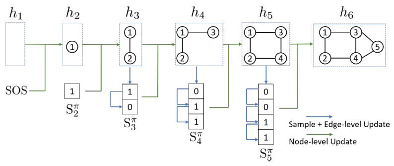
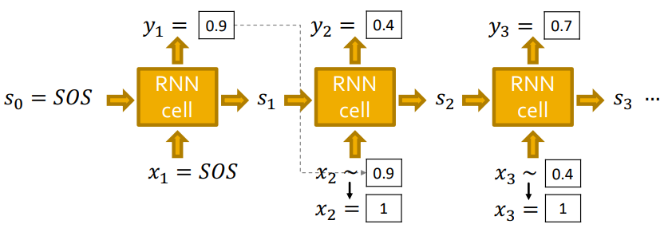
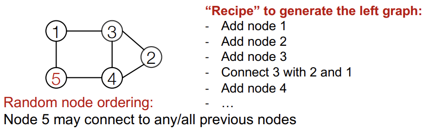
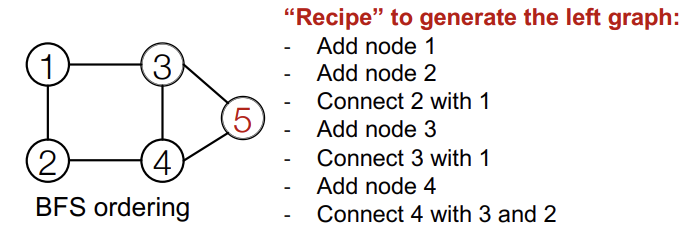
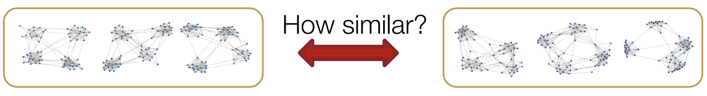
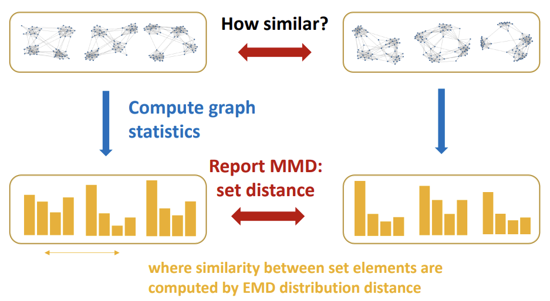
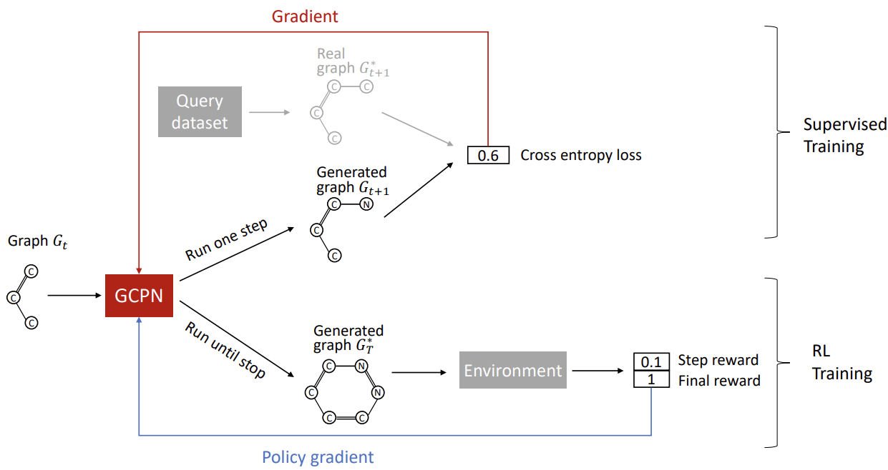

# Lecture 15: Deep Generative Models for Graphs

## Lecutre 15.1: Machine Learning for Graph Generation
- Task1: Realistic graph generation
- Task2: Goal-directed graph generation
---
Key principle: Maximum Likelihood
$$\boldsymbol{\theta}^*=\underset{\boldsymbol{\theta}}{\arg \max } \mathbb{E}_{x \sim p_{\text {data }}} \log p_{\text {model }}(\boldsymbol{x} \mid \boldsymbol{\theta})$$

- Idea: Chain rule. Joint distribution is a product of conditional distributions: $$ p_{\text {model }}(\boldsymbol{x} ; \theta)=\prod_{t=1}^n p_{\text {model }}\left(x_t \mid x_1, \ldots, x_{t-1} ; \theta\right) $$
    * E.g., $\boldsymbol{x}$ is a vector, $x_t$ is the $t$-th dimension; $\boldsymbol{x}$ is a sentence, $x_t$ is the $t$-th word.
    * In our case: $x_t$ will be the $t$-th action (add node, add edge)

## Lecutre 15.2:  GraphRNN: Generating Realistic Graphs

- Node ordering is randomly selected.
- It is basically generating binary sequences.
    - For a stochastic generation, RNN generates a probability for each step.

### Example

- Stochastic result
- Teacher Forcing
- Replace input at each step by GraphRNN's own predictions.

## Lecutre 15.3: Scaling Up and Evaluating Graph Generation
### Issue of the GraphRNN: Tractability
Compare:

- First: Complex too-long edge dependencies
- BFS node ordering:
    - Since Node 4 doesn't connect to Node 1
    - We know all Node 1's neighbors have already been traversed
    - Therefore, Node 5 and the following nodes will never connect to node 1
    - We only need memory of 2 "steps" rather than $\mathrm{n}-1$ steps (in this case)

---

### Evaluating Generated Graphs

- Visual similarity
- Graph statistics similarity
    - Step 1: Earth Mover Distance (EMD)
    - Step 2: Maximum Mean Discrepancy (MMD)
        - Idea of representing distances between distributions as distances between mean embeddings of feature
        - $\operatorname{MMD}^2(p \| q) =\mathbb{E}_{x, y \sim p}[k(x, y)]+\mathbb{E}_{x, y \sim q}[k(x, y)]  -2 \mathbb{E}_{x \sim p, y \sim q}[k(x, y)]$ for a kernel $k$.

## Lecutre 15.4: Application of Deep Graph Generative Models

### Drug Discovery and GCPN
- Graph Convolutional Policy Network
    - graph representation + RL
    - Key component of GCPN:
        - Graph Neural Network captures graph structural information
        - Reinforcement learning guides the generation towards the desired objectives
        - Supervised training imitates examples in given datasets
    - Sequential graph generation
    - Two parts:
        - (1) Supervised training: Train policy by imitating the action given by real observed graphs. Use gradient.
            - We have covered this idea in GraphRNN
        - (2) RL training: Train policy to optimize rewards. Use standard policy gradient algorithm

