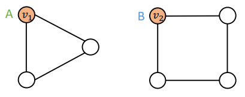

# Lecture 16: Advanced Topics in Graph Neural Networks

## Lecture 16.1: Limitations of Graph Neural Networks
- Without any discriminative features, our GNN models cannot distinguish the triangle and the rectangle.
- A naïve solution: One-hot encoding
    - Not scalable: Need $O(N)$ feature dimensions
    - Not inductive: Cannot generalize to new nodes/graphs

## Lecture 16.2:  Position-aware Graph Neural Networks
There are 2 types of tasks on GNN:
- Structure-aware task
- Position-aware task: GNNs fail.
    - Can we define deep learning methods that are position-aware?

---
### Anchor
- Randomly pick a node $s_1$ as an anchor node
- Represent $v_1$ and $v_2$ via their relative `distances` w.r.t. the anchor $s_1$, which are different
- An anchor node serves as a coordinate axis
    - Which can be used to locate nodes in the graph
- We can use multiple nodes.

### Anchor-sets
- Generalize anchor from a single node to a set of nodes
    - We define distance to an anchor-set as the minimum distance to all the nodes in the ancho-set
- Observation: Large anchor-sets can sometimes provide more precise position estimate
    - We can save the total number of anchors

---

* You can ask how many of these sets do you need and how big they need to be?
    * We'll have some relatively small number of anchor sets where each next anchor set size is going to be doubled, but the number of them will be half of what we had before.

---

Use these position encodings as augmented node features(works well in practice)
- Issue: since each dimension of position encoding is tied to a random anchor, dimensions of positional encoding can be randomly permuted, without changing its meaning 
    - Imagine you permute the input dimensions of a normal NN, the output will surely change
- The rigorous solution: requires a special NN that can maintain the `permutation invariant` property of position encoding
- Permuting the input feature dimension will only result in the permutation of the output dimension, the value in each dimension won't change

## Lecture 16.3: Identity-Aware Graph Neural Networks
- GNNs exhibit three levels of failure cases in structure-aware tasks:
    - Node level  
    
    - Edge level - same prob. for the edge prediction task  
    
    - Graph level  
    
        - Corner case for WL test.
---
### Idea: Inductive Node Coloring

### Idea: Heterogenous message passing
different types of message passing is applied to different nodes.

ID-GNN:  

- Why does ID-GNN work better than GNN?
    - Intuition: ID-GNN can count cycles originating from a given node, but GNN cannot
    - Based on the intuition, we propose a simplified version `ID-GNN-Fast`
        - Use cycle counts in each layer as an augmented node feature. Also can be used together with `any GNN`

---

- Summary of ID-GNN
    - A general and powerful extension to GNN framework
    - We can apply ID-GNN on any message passing GNNs (GCN, GraphSAGE, GIN, ...)
    - ID-GNN provides consistent performance gain in node/edge/graph level tasks
    - ID-GNN is more expressive than their GNN counterparts. ID-GNN is the first message passing GNN that is more expressive than 1-WL test

## Lecture 16.4: Robustness of Graph Neural Networks

Example: In node classification task, we want to change a label of a node.

- Direct Attack: Attacker node is the target node: $S = \{t\}$.
    - Modify target node feature
    - Add/Remove connections to/from target
- Indirect Attack: The target node is not in the attacker nodes: $t\notin S$
    - Modify attacker node features
    - Add/Remove connections to/from attackers

Objective for the attacker: `Maximize (change of target node label prediction) Subject to (graph manipulation is small)`  
i.e., assumption: $\left(\boldsymbol{A}^{\prime}, \boldsymbol{X}^{\prime}\right) \approx(\boldsymbol{A}, \boldsymbol{X})$ 

Optimize the function: 
$$\log f_{\boldsymbol{\theta}^{* \prime}}\left(\boldsymbol{A}^{\prime}, \boldsymbol{X}^{\prime}\right)_{v, c_v^{* \prime}}-\log f_{\boldsymbol{\theta}^{* \prime}}\left(\boldsymbol{A}^{\prime}, \boldsymbol{X}^{\prime}\right)_{v, c_v^*}$$
- $\boldsymbol{\theta}^{* \prime}$: the case where we can change the training data for the GNN

### Challenges in optimizing the objective
- Adjacency matrix $\boldsymbol{A}^{\prime}$ is a discrete object: gradient-based optimization cannot be used.
- For every modified graph $\boldsymbol{A}^{\prime}$ and $\boldsymbol{X}^{\prime}, \mathrm{GCN}$ needs to be retrained (this is computationally expensive):
    - $$ \boldsymbol{\theta}^{* \prime}=\operatorname{argmin}_{\boldsymbol{\theta}} \mathcal{L}_{\text {train }}\left(\boldsymbol{\theta} ; \boldsymbol{A}^{\prime}, \boldsymbol{X}^{\prime}\right) $$
- Several approximaRtions are proposed to make the optimization tractable 

### Result: 
- Adversarial direct attack is the strongest attack, significantly worsening GCN's performance
- Random attack is much weaker than adversarial attack.
- Indirect attack is more challenging than direct attack.
- GCN is not robust to adversarial attacks but it is somewhat robust to indirect attacks and random noise.